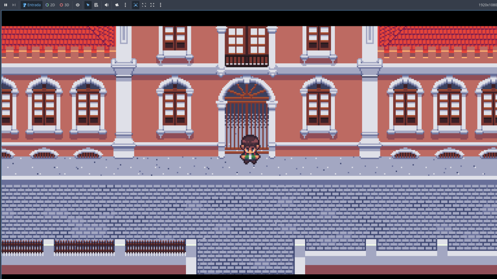
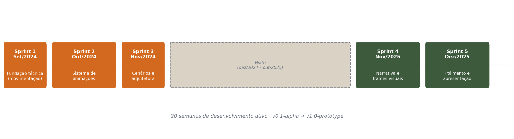

<<<<<<< HEAD
# 📓 Notas do Projeto: EquinoxMed
=======
# README - Jogo Indie: "Caminho das Folhas Perdidas"
>>>>>>> parent of bc6c410 (Update README.md)

> **Visão Geral:** Este repositório contém a implementação do **EquinoxMed**, um Portal Cativo (Captive Portal) voltado para o ambiente hospitalar. O sistema atua como um gateway de autenticação de rede, interceptando o tráfego de usuários até que eles se autentiquem, validem suas credenciais ou aceitem os termos de uso da rede do hospital.

<<<<<<< HEAD
=======
<!-- CAMINHO DAS FOLHAS PERDIDAS é um emocionante jogo indie que combina elementos de ação, aventura e quebra-cabeças para oferecer uma experiência de jogo única. Nele, os jogadores assumem o papel de um personagem principal (insira o nome do personagem) e embarcam em uma jornada épica por mundos misteriosos e desafiadores. -->

## Principais Características
- Exploração na Floresta
 - Estilo de Sobrevivência na Floresta
 - Estilo Pixel Art Top Down
 - Multiplataforma (MacOS, Windows, Linux e Android)

### Gameplay

- **Controles Intuitivos**: 
+ W = Cima
+ S = Baixo
+ A = Esquerda
+ D = Direita
>>>>>>> parent of bc6c410 (Update README.md)
---
- **Cenas Interativas**: 

<<<<<<< HEAD
## 🎓 Contexto Acadêmico
Este projeto foi desenvolvido de forma colaborativa com colegas de equipe durante o curso de Tecnologia em **Análise e Desenvolvimento de Sistemas (ADS)** no **Instituto Federal do Pará (IFPA) - Campus Óbidos**.
=======
- **Quebra-Cabeças Criativos**: 

- **Combate Empolgante**: 

### História

- **Narrativa Imersiva**: <!-- Mergulhe em uma história envolvente repleta de reviravoltas e personagens cativantes. -->

- **Escolhas do Jogador**:<!--  Suas escolhas afetarão o desenrolar da história e o destino do seu personagem. -->

<!-- 
## Parâmetros Modificáveis

O **Nome do Seu Jogo** permite que os desenvolvedores e jogadores modifiquem uma série de parâmetros para personalizar a experiência do jogo:

1. **Dificuldade**: Ajuste o nível de dificuldade de acordo com sua preferência, desde o modo fácil para uma experiência mais relaxante até o modo difícil para um desafio extremo.

2. **Modo de Jogo**: Escolha entre diferentes modos de jogo, como o modo história, modo de sobrevivência, ou modos de desafio exclusivos.

3. **Personalização do Personagem**: Desbloqueie e escolha entre uma variedade de skins, trajes e acessórios para personalizar o visual do seu personagem.

4. **Configurações de Gráficos**: Ajuste as configurações gráficas para otimizar o desempenho ou aproveitar ao máximo os visuais deslumbrantes.

5. **Configurações de Áudio**: Personalize as configurações de áudio para obter a melhor experiência de áudio, desde efeitos sonoros imersivos até a música de fundo.

6. **Modificadores de Quebra-Cabeça**: Desbloqueie e ative modificadores de quebra-cabeças para tornar os enigmas mais simples ou mais desafiadores, de acordo com sua preferência.
 -->
## Como Jogar
>>>>>>> parent of bc6c410 (Update README.md)

---

## 🛠️ Stack Tecnológico

*   **Backend:** Python (Flask/Framework WSGI nativo)
*   **Frontend:** HTML5, CSS3, JavaScript (Vanilla)
*   **Controle de Dependências:** `requirements.txt`
*   **Serviços Mapeados:** Autenticação de Rede, Gerenciamento de Sessão, Registro de Funcionários/Usuários.

---

## 🏗️ Arquitetura e Módulos Principais

<<<<<<< HEAD
O sistema é gerido através de um módulo core (`hospital_captive_portal.py`), que orquestra as seguintes rotas e lógicas:

1.  **Portal de Interceptação (Captive Portal):** Redireciona o usuário recém-conectado à rede para a tela de seleção de perfil.
2.  **Módulo de Autenticação:** Separação lógica entre fluxos de login para diferentes entidades (`teladelogin.html`).
3.  **Módulo de Cadastro e Termos:** Fluxo de criação de contas (Funcionários/Visitantes) condicionado ao aceite de normas (`Termos.html`).
4.  **Painel de Administração:** Interface de gestão e controle de usuários logados e autorizados na rede (`controleusuario.html`, `painel_usuario.html`).
=======
### Branches
~~~
~~~
## Requisitos de Sistema
>>>>>>> parent of bc6c410 (Update README.md)

---

<<<<<<< HEAD
## 📸 Interface e Telas (Placeholders)

### 1. Tela de Seleção (Gateway Inicial)
*(O usuário conecta no Wi-Fi e é apresentado a esta tela)*
<div align="center">
  
  <br>
  <!-- Adicione a captura de tela da página 'teladeselecao.html' aqui -->
  <code>[ ESPAÇO PARA SCREENSHOT: teladeselecao.html ]</code>
</div>

### 2. Fluxo de Autenticação e Termos
*(Interface onde as políticas do hospital são validadas)*
<div align="center">
  <!-- Adicione a captura de tela da página 'teladelogin.html' e 'Termos.html' aqui -->
  <code>[ ESPAÇO PARA SCREENSHOT: teladelogin.html ]</code>
</div>

### 3. Painel de Controle de Usuários
*(Visão gerencial para controle de acesso à rede)*
<div align="center">
  <!-- Adicione a captura de tela da página 'controleusuario.html' aqui -->
  <code>[ ESPAÇO PARA SCREENSHOT: controleusuario.html ]</code>
</div>
=======
### Sistema Operacional: 
- Linux (.run)
- Windows (.exe)
### Processador: 
 - 
 -

### Memória RAM:
-

### Placa de Vídeo:
- 
### Armazenamento:
-
## Contato
<!-- 
- Email de Suporte: marciomoda@gmail.com
- Email de Suporte: 
- Email de Suporte:marciomoda@gmail.com
- Redes Sociais:  -->
>>>>>>> parent of bc6c410 (Update README.md)

---

## 🚀 Como Executar o Ambiente de Desenvolvimento

<<<<<<< HEAD
**1. Clone e Preparação do Ambiente**
```bash
# Clone o repositório
git clone <url-do-repositorio>
cd EquinoxMed

<<<<<<< HEAD
Não é um jogo genérico sobre folclore brasileiro: o recorte é local e específico. Os cenários reproduzem lugares reais de Óbidos (Museu Integrado, Casa de Cultura, Rua Justo Chermont), e a jornada do jogador é construída em torno de lendas obidenses específicas, não do folclore nacional amplo.

O protótipo foi validado com **34 participantes** durante a X Semana de Ciência, Tecnologia e Cultura do IFPA Campus Óbidos (dez/2025): **100% de aprovação no envolvimento narrativo**, **91,2% de aceitação da intuitividade dos controles**, e **17,6% dos participantes tiveram na experiência seu primeiro contato com a lenda** — evidência direta de que a proposta cumpre o objetivo de disseminação cultural.

---

## Equipe

| Integrante | Função |
|---|---|
| Edy Carlos de Santana Souza | Coordenação geral, roteiro e narrativa, documentação acadêmica |
| Laísa Graziela da Silva Leão | Coordenação geral, roteiro e narrativa, documentação acadêmica |
| Márcio Augusto Bentes Moda | Programação técnica (GDScript / Godot Engine) |
| João Manoel Siqueira de Araújo | Arte visual — sprites em pixel art de personagens e cenários |

Orientação: Prof. Me. Angel Pena Galvão · Coorientação: Prof. Esp. John Percival Rodrigues Linhares

---

## Narrativa

Igor, 19 anos, testemunha sua amiga Eduarda ser levada por uma aparição sobrenatural — **Ormíria, a Noiva do Museu** — na Rua Justo Chermont, em frente ao antigo casarão que hoje é o Museu Integrado de Óbidos. A partir daí, Igor precisa adentrar o universo das lendas locais para resgatá-la.

A história foi planejada em **quatro capítulos**; o protótipo atual implementa o **Capítulo 1 por completo** e tem o roteiro do Capítulo 2 em fase inicial:

| Capítulo | Cenário | Status |
|---|---|---|
| 1 — Início da Jornada | Rua Justo Chermont, Museu Integrado | Roteiro completo, implementado |
| 2 — Nas Águas do Rio | Rio Amazonas | Roteiro em fase inicial |
| 3 e 4 | Serra da Escama, Matriz de Sant'Ana | Planejamento narrativo |

**Lendas obidenses integradas à história** (uma implementada, cinco planejadas):

- **A Noiva do Museu** — antagonista central, único elemento folclórico já jogável.
- **O Curupira** — guardião da mata, testa as intenções de Igor (Capítulo 1, não implementado).
- **O Neguinho do Laguinho** — guia silencioso pelo rio (transição Cap. 1→2).
- **O Boto Cor-de-Rosa** — entidade sedutora (Capítulo 2).
- **A Lenda da Porca** — papel narrativo ainda em definição.
- **A Cobra Grande de Óbidos** — adversidade prevista para o Capítulo 3.

---

## Gameplay

<p align="center">
  
</p>

O jogo prioriza exploração e narrativa sobre combate — não há sistema de combate, inventário ou grinding implementados intencionalmente. As mecânicas atuais:

- **Movimentação** — 4 direções cardinais via WASD, `CharacterBody2D` com velocidade de 64px/s, aceleração e fricção interpoladas (`lerp`) para transições suaves.
- **Animação** — 5 estados (`correr_frente`, `correr_costa`, `correr_direita`, `correr_esquerda`, `parado_frente`), com priorização de animação horizontal em movimento diagonal.
- **Diálogo / visual novel** — frames narrativos estáticos com caixa de texto, avançados via Enter/Espaço; estrutura de dados pronta para ramificação de diálogo, ainda não usada no protótipo atual.

---

## Arquitetura técnica

Godot Engine **4.5.1**, GDScript, arquitetura de nós hierárquicos (scene tree).

```
A_cacada_pela_verdade/
├── cenas/
│   ├── menu/        # menu_main, controles, créditos, splash_screen
│   └── act01/        # cenas jogáveis do Capítulo 1
├── scripts/
│   ├── player.gd            # movimentação + animações
│   ├── menu_principal.gd    # navegação entre telas
│   └── splash_screen.gd
├── assets/
│   ├── sprites/      # personagens e cenários
│   └── frames_narrativos/
└── project.godot
=======
# Recomenda-se o uso de um ambiente virtual
python -m venv venv
source venv/bin/activate  # ou venv\Scripts\activate no Windows
>>>>>>> parent of 8511029 (Add files via upload)
```

**2. Instalação de Dependências**
```bash
pip install -r requirements.txt
```

<<<<<<< HEAD
Build final: ~45 MB, 1280×720 (HD), 60 FPS, exportado para Windows e Linux.

---

## Metodologia de desenvolvimento

Desenvolvido em **RAD (Rapid Application Development)** — 5 sprints entre setembro de 2024 e dezembro de 2025, com um hiato de quase um ano entre as etapas técnica e de narrativa/polimento.

<p align="center">
  
</p>

Um ponto que vale registrar como decisão consciente, não como atalho: no Sprint 5, produzir os frames narrativos manualmente (~20-30h por frame) inviabilizaria a entrega no prazo. A equipe optou por um processo híbrido — geração via IA (Imagen 3, plataforma Lovart) a partir de prompts próprios e dos sprites originais como referência, com curadoria humana rigorosa e critérios objetivos de aprovação (coerência estética, anatomia, fidelidade ao design, adequação emocional, paleta cromática). Isso está documentado no TCC junto com as considerações éticas: autoria dos prompts é da equipe, os sprites originais permanecem de autoria exclusiva de João Manoel (com termo de autorização formal), e a equipe é explícita de que, com orçamento, contrataria ilustrador profissional para a versão comercial.

---

## Ferramentas utilizadas

| Ferramenta | Função | Licença |
|---|---|---|
| Godot Engine 4.3 | Game engine | GPL v3 |
| LibreSprite 1.1 | Pixel art | GPL v2 |
| GIMP 2.10 | Edição raster | GPL v3 |
| Inkscape 1.4 | Edição vetorial | GPL v3 |
| Audacity / LMMS | Áudio | — |
| Git / GitHub 2.43 | Versionamento | GPL v3 |
| Google Forms | Coleta de dados de validação | Proprietário |
| Lovart (Imagen 3) | Geração de frames narrativos | Experimental |

---

## Requisitos e como jogar

| | |
|---|---|
| SO | Windows (.exe) ou Linux (.run) |
| Processador | Intel i3 3ª geração ou superior |
| RAM | 2 GB DDR3 |
| Controles | W/A/S/D para movimentação · Enter/Espaço para avançar diálogo |

Baixe o executável, sem necessidade de instalação, e execute diretamente.

---

## Licença

O jogo está sob **licença proprietária privada vinculada ao registro acadêmico no IFPA**: download e uso pessoal são livres, mas modificação, engenharia reversa e comercialização exigem autorização prévia por escrito. Veja [`LICENSE`](LICENSE).

---

<div align="center">

IFPA Campus Óbidos · 2025-2026

</div>
=======
**3. Inicialização do Servidor**
```bash
python hospital_captive_portal.py
```
*O servidor estará escutando as requisições, simulando a captura de tráfego de rede para redirecionamento ao painel.*
>>>>>>> parent of 8511029 (Add files via upload)
=======
Divirta-se jogando **Caminho das Folhas Perdidas** e somos gratos por apoiar o desenvolvimento de jogos indie!
>>>>>>> parent of bc6c410 (Update README.md)
