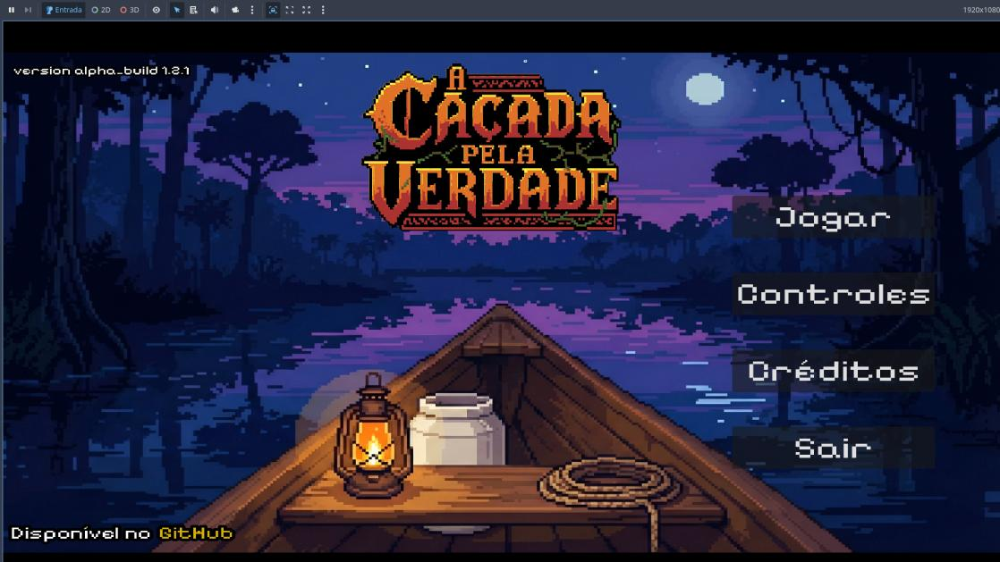

<div align="center">

# 🌙 A Caçada pela Verdade

**RPG de aventura top-down em pixel art, ambientado em Óbidos (PA), construído sobre a lenda da "Noiva do Museu".**

Trabalho de Conclusão de Curso — Tecnólogo em Análise e Desenvolvimento de Sistemas, IFPA Campus Óbidos · 🏆 3º lugar, categoria Projeto de Pesquisa, X SCTC/IFPA (2025)



</div>

---

## Sobre o projeto

**A Caçada pela Verdade** nasceu como Trabalho de Conclusão de Curso com um objetivo específico: usar um jogo digital para valorizar o patrimônio imaterial de Óbidos (PA) — em especial a lenda urbana da **"Noiva do Museu"** — para um público que, cada vez mais, se distancia dessas narrativas orais tradicionais.

Não é um jogo genérico sobre folclore brasileiro: o recorte é local e específico. Os cenários reproduzem lugares reais de Óbidos (Museu Integrado, Casa de Cultura, Rua Justo Chermont), e a jornada do jogador é construída em torno de lendas obidenses específicas, não do folclore nacional amplo.

O protótipo foi validado com **34 participantes** durante a X Semana de Ciência, Tecnologia e Cultura do IFPA Campus Óbidos (dez/2025): **100% de aprovação no envolvimento narrativo**, **91,2% de aceitação da intuitividade dos controles**, e **17,6% dos participantes tiveram na experiência seu primeiro contato com a lenda** — evidência direta de que a proposta cumpre o objetivo de disseminação cultural.

---

## Equipe

| Integrante | Função |
|---|---|
| Edy Carlos de Santana Souza | Coordenação geral, roteiro e narrativa, documentação acadêmica |
| Laísa Graziela da Silva Leão | Coordenação geral, roteiro e narrativa, documentação acadêmica |
| Márcio Augusto Bentes Moda | Programação técnica (GDScript / Godot Engine) |
| João Manoel Siqueira de Araújo | Arte visual — sprites em pixel art de personagens e cenários |

Orientação: Prof. Me. Angel Pena Galvão · Coorientação: Prof. Esp. John Percival Rodrigues Linhares

---

## Narrativa

Igor, 19 anos, testemunha sua amiga Eduarda ser levada por uma aparição sobrenatural — **Ormíria, a Noiva do Museu** — na Rua Justo Chermont, em frente ao antigo casarão que hoje é o Museu Integrado de Óbidos. A partir daí, Igor precisa adentrar o universo das lendas locais para resgatá-la.

A história foi planejada em **quatro capítulos**; o protótipo atual implementa o **Capítulo 1 por completo** e tem o roteiro do Capítulo 2 em fase inicial:

| Capítulo | Cenário | Status |
|---|---|---|
| 1 — Início da Jornada | Rua Justo Chermont, Museu Integrado | Roteiro completo, implementado |
| 2 — Nas Águas do Rio | Rio Amazonas | Roteiro em fase inicial |
| 3 e 4 | Serra da Escama, Matriz de Sant'Ana | Planejamento narrativo |

**Lendas obidenses integradas à história** (uma implementada, cinco planejadas):

- **A Noiva do Museu** — antagonista central, único elemento folclórico já jogável.
- **O Curupira** — guardião da mata, testa as intenções de Igor (Capítulo 1, não implementado).
- **O Neguinho do Laguinho** — guia silencioso pelo rio (transição Cap. 1→2).
- **O Boto Cor-de-Rosa** — entidade sedutora (Capítulo 2).
- **A Lenda da Porca** — papel narrativo ainda em definição.
- **A Cobra Grande de Óbidos** — adversidade prevista para o Capítulo 3.

---

## Gameplay

<p align="center">
  
</p>

O jogo prioriza exploração e narrativa sobre combate — não há sistema de combate, inventário ou grinding implementados intencionalmente. As mecânicas atuais:

- **Movimentação** — 4 direções cardinais via WASD, `CharacterBody2D` com velocidade de 64px/s, aceleração e fricção interpoladas (`lerp`) para transições suaves.
- **Animação** — 5 estados (`correr_frente`, `correr_costa`, `correr_direita`, `correr_esquerda`, `parado_frente`), com priorização de animação horizontal em movimento diagonal.
- **Diálogo / visual novel** — frames narrativos estáticos com caixa de texto, avançados via Enter/Espaço; estrutura de dados pronta para ramificação de diálogo, ainda não usada no protótipo atual.

---

## Arquitetura técnica

Godot Engine **4.5.1**, GDScript, arquitetura de nós hierárquicos (scene tree).

```
A_cacada_pela_verdade/
├── cenas/
│   ├── menu/        # menu_main, controles, créditos, splash_screen
│   └── act01/        # cenas jogáveis do Capítulo 1
├── scripts/
│   ├── player.gd            # movimentação + animações
│   ├── menu_principal.gd    # navegação entre telas
│   └── splash_screen.gd
├── assets/
│   ├── sprites/      # personagens e cenários
│   └── frames_narrativos/
└── project.godot
```

Trecho de `player.gd` — sistema de movimentação com interpolação linear (elimina início/parada bruscos) e normalização do vetor de direção (evita que o personagem ganhe velocidade extra em diagonal, bug comum em jogos top-down):

```gdscript
func _move():
    var _direction: Vector2 = Vector2(
        Input.get_axis("move_left", "move_right"),
        Input.get_axis("move_up", "move_down")
    )
    if _direction != Vector2.ZERO:
        velocity.x = lerp(velocity.x, _direction.normalized().x * _move_speed, _acceleration)
        velocity.y = lerp(velocity.y, _direction.normalized().y * _move_speed, _acceleration)
        return
    velocity.x = lerp(velocity.x, _direction.normalized().x * _move_speed, _friction)
    velocity.y = lerp(velocity.y, _direction.normalized().y * _move_speed, _friction)
```

Build final: ~45 MB, 1280×720 (HD), 60 FPS, exportado para Windows e Linux.

---

## Metodologia de desenvolvimento

Desenvolvido em **RAD (Rapid Application Development)** — 5 sprints entre setembro de 2024 e dezembro de 2025, com um hiato de quase um ano entre as etapas técnica e de narrativa/polimento.

<p align="center">
  
</p>

Um ponto que vale registrar como decisão consciente, não como atalho: no Sprint 5, produzir os frames narrativos manualmente (~20-30h por frame) inviabilizaria a entrega no prazo. A equipe optou por um processo híbrido — geração via IA (Imagen 3, plataforma Lovart) a partir de prompts próprios e dos sprites originais como referência, com curadoria humana rigorosa e critérios objetivos de aprovação (coerência estética, anatomia, fidelidade ao design, adequação emocional, paleta cromática). Isso está documentado no TCC junto com as considerações éticas: autoria dos prompts é da equipe, os sprites originais permanecem de autoria exclusiva de João Manoel (com termo de autorização formal), e a equipe é explícita de que, com orçamento, contrataria ilustrador profissional para a versão comercial.

---

## Ferramentas utilizadas

| Ferramenta | Função | Licença |
|---|---|---|
| Godot Engine 4.3 | Game engine | GPL v3 |
| LibreSprite 1.1 | Pixel art | GPL v2 |
| GIMP 2.10 | Edição raster | GPL v3 |
| Inkscape 1.4 | Edição vetorial | GPL v3 |
| Audacity / LMMS | Áudio | — |
| Git / GitHub 2.43 | Versionamento | GPL v3 |
| Google Forms | Coleta de dados de validação | Proprietário |
| Lovart (Imagen 3) | Geração de frames narrativos | Experimental |

---

## Requisitos e como jogar

| | |
|---|---|
| SO | Windows (.exe) ou Linux (.run) |
| Processador | Intel i3 3ª geração ou superior |
| RAM | 2 GB DDR3 |
| Controles | W/A/S/D para movimentação · Enter/Espaço para avançar diálogo |

Baixe o executável, sem necessidade de instalação, e execute diretamente.

---

## Licença

O jogo está sob **licença proprietária privada vinculada ao registro acadêmico no IFPA**: download e uso pessoal são livres, mas modificação, engenharia reversa e comercialização exigem autorização prévia por escrito. Veja [`LICENSE`](LICENSE).

> Nota: o arquivo de licença atual lista Grazi Leão, João Araújo e Márcio Moda como titulares dos direitos autorais, mas não inclui Edy Carlos de Santana Souza — apesar de constar como coautor do TCC e responsável pela coordenação geral do projeto. Vale atualizar o `LICENSE` para refletir os quatro integrantes da equipe corretamente antes da transferência do repositório.

---

<div align="center">

IFPA Campus Óbidos · 2025-2026

</div>
